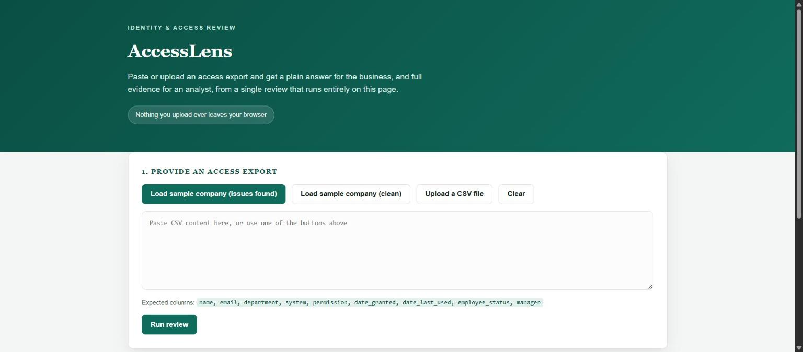
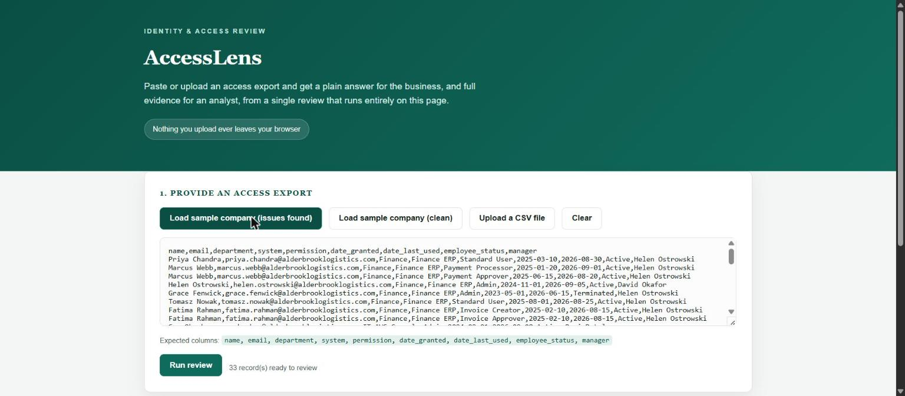
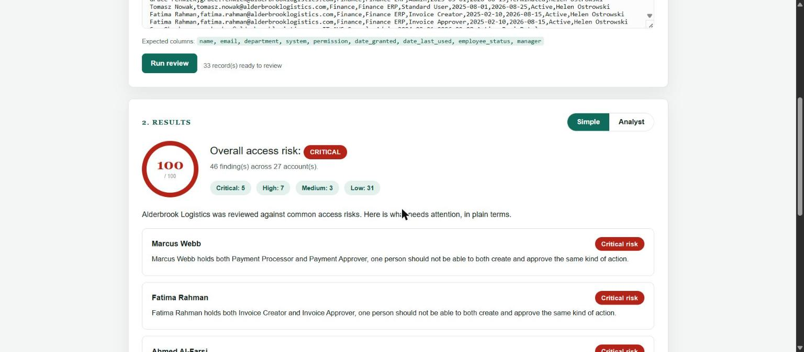
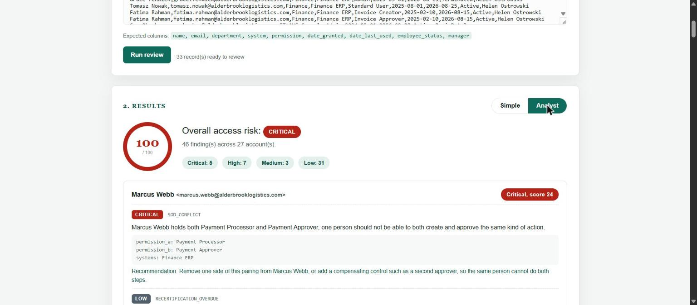
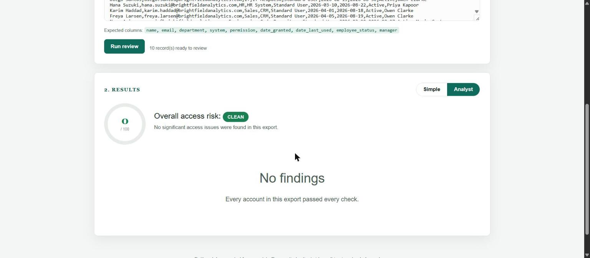

# AccessLens Walkthrough

A short guide to actually using AccessLens, written for someone opening it
for the first time. Every screenshot below is taken from the real, live
demo.

## Step 1, open the demo

Go to https://ubaidraza5.github.io/accesslens. Nothing needs installing,
and no signup is required. The page explains itself, paste or upload an
access export and the check runs entirely on your own screen.



## Step 2, load some data

If you do not have an export ready to test with, use one of the two
sample companies. Alderbrook Logistics has a full set of realistic,
deliberately planted issues, useful for seeing what a problem report
looks like. Brightfield Analytics is a clean company with nothing wrong,
useful for seeing what a healthy result looks like.

To use your own data instead, either press Upload a CSV file and choose
your export, or paste the CSV text straight into the box. See
`USAGE.md` for the exact columns AccessLens expects.



## Step 3, run the review

Press Run review. The results appear straight below, there is no waiting,
the whole analysis happens instantly on your own device.

## Step 4, read the simple summary

By default you land on the Simple view. This is written for anyone in the
business, not just a security team. At the top is an overall score out of
100 and a risk level. Below that are the accounts that need attention
first, each with a plain sentence explaining what is wrong.



## Step 5, switch to the analyst view

Press Analyst at the top right of the results panel to see the full
technical breakdown, every finding for every account, with its severity,
the evidence behind it, and a recommended next step. Company wide issues
that are not tied to one person, like too many admins on a single system,
appear in their own section at the bottom.



## Step 6, try the clean example

Go back to step 2 and press Load sample company (clean) instead, then run
the review again. This shows what a well handled access setup looks like,
a score of zero and a Clean result.



## Step 7, run it from the command line instead

If you would rather run this as part of a script or a regular process
rather than through the browser, the same engine is available as a
Python command line tool.

```bash
python main.py your_export.csv
```

See `USAGE.md` for every option, including the analyst report, JSON
export, and using AccessLens as a pass or fail gate in a pipeline.

## What to do with the results

Start with anything marked Critical, these are the issues most reviewers
would want fixed the same day, access left behind after someone left the
company, or one person able to both request and approve the same action.
High priority items are usually next, followed by the smaller cleanup
items. Share the report, in Simple mode, with the manager listed against
each account, since they are usually the person who can confirm whether
the access is still needed.
